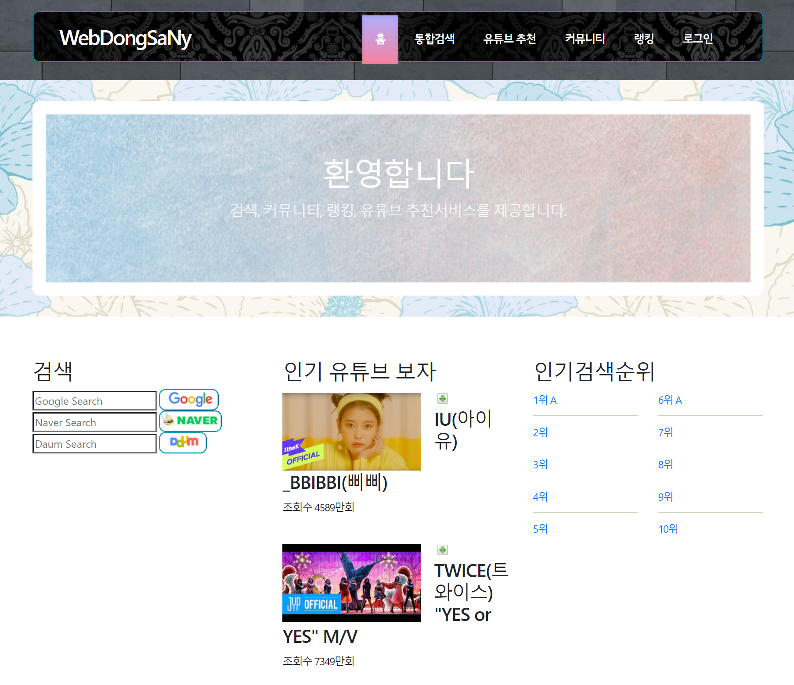

# 커뮤니티 게시판
## 웹서비스 설계

웹 서비스 설계를 위해 JSP를 이용하여 커뮤니티 게시판을 만든 프로젝트.

- 수업때 배웠던 JSP를 활용하여 게시판을 구현하는것이 목표
- 4명 구성원 (컴퓨터과학과) 2개월 작업.

## Features

- 회원 관리 시스템 구현
- 게시판 글 CRUD 구현
- 포인트및 랭킹 시스템 구현
- 쪽지 기능 구현
- 친구 기능 구현

## Tech

- JSP
   - HTML과 CSS JavaScript를 기반으로 Java의 기능을 추가한 JSP를 배워서 커뮤니티 게시판을 만들었다. Servlet의 기본적인 개념과 함께 JSTL의 기초까지 사용하여 게시판 구현을 유연하게 프로그래밍 할 수 있었다.
- MySQL
    - DB에 저장하기 위해 DBMS를 MySQL을 사용하였다. 자바와의 연동을 위해 JDBC를 이용하여 회원 관리 및 게시글과 포인트 쪽지 친구 등 여러개의 테이블에 실제 데이터를 저장하는 작업을 했다.

- JavaScript
    -  HTML,CSS에 대한 기본적인 개념만 알고 있었고 JavaScript에 대해서는 아무것도 몰랐다. 그래서 게시판을 만들 수 있을 만큼 Jquery를 기반으로 문장을 하나 하나 넣어 보고 거기에 대해 모르는 부분을 공부하면서 구현 후 공부 그리고 원하는 기능으로 재구현 하는 방식으로 빠르게 기능을 개발하였다.
    

## Review
웹에 대한 지식이 거의 없었다. 네트워크가 어떻게 구성되고 어떤 원리로 동작하는지에 대한 개념만 있었는데 HTML, CSS, JavaScript를 기반으로 조그만한 프로그램부터 시작하여 종단에는 JSP를 활용하여 WAS와 상호 연동하여 커뮤니티 게시판을 구현할 수 있었다. 프론트 쪽은 개발 한 결과가 바로바로 화면에 출력되는 것을 볼 수 있어서 좋았다. 또한 JavaScript만으로는 구현하지 못했을텐데 Jquery의 도움을 많이 받아 빠르게 개발할 수 있었고 이를 토대로 JSP로 서버단까지 개발할 수 있는 웹을 처음부터 천천히 한단계씩 직접 구현하고 개선할 수 있는 좋은 경험의 프로젝트였다.

## Screenshot

## License

MIT

[//]: # (These are reference links used in the body of this note and get stripped out when the markdown processor does its job. There is no need to format nicely because it shouldn't be seen. Thanks SO - http://stackoverflow.com/questions/4823468/store-comments-in-markdown-syntax)
